# Educación en linea
¿Te imaginas cómo será la educación del futuro? Seguro puedes elevar tanto tus pensamientos que podrás llevarlos a salas interactivas, tendrás asistentes digitales y estudiantes de todo el mundo aprendiendo al mismo tiempo. La tecnología transforma la educación en todos niveles, algunas instituciones ya están trabajando por alcanzar dichas tareas.

## Objetivo del proyecto
- Identificar oportunidades para desarrollar estrategias, servicios y/o modelos de negocio que mejoren la experiencia de estudio, docencia y gestión dentro de una universidad en línea.
- Entender las necesidades de diferentes stakeholders para nuevos conceptos de productos que apoyen la educación no presencial.
- Identificar los diferentes perfiles de las personas que se acercan a una universidad en línea.
- Desarrollar una visión estratégica sobre cómo las herramientas tecnológicas pueden mejorar la experiencia de estudio, docencia y gestión en el día a día de estudiantes, profesores y personal académico de una universidad o institución con programas educativos 100% online.

## Objetivo de aprendizaje
Comprender el diseño estratégico como un proceso que, a través del entendimiento del usuario, permite desarrollar un pensamiento sistémico y proponer soluciones innovadoras para problemas complejos (wicked problems). Familiarizarse con herramientas relacionadas al diseño estratégico como trend scan, insights y oportunidades, diseño de conceptos de solución y roadmap de implementación.

## Tendencias de la educación superior
De acuerdo con el informe Tendencias de la educación superior en América Latina y el Caribe 2018 elaborado por la UNESCO-ESALC y UNC se reconoce que la región vive la masificación de la demanda social por la educación superior. Esto significa que atrás quedaron los números reducidos de personas con posibilidad de llegar a la formación universitaria, lo cual ha movilizado a las instituciones para cubrir las necesidades.

Ante esta situación, se ha notado un incremento de universidades de tipo privado con más del 50% de la matrícula universitaria de América Latina, a diferencia de lo que ocurría hasta la década de los 80 en que era predominantemente estatal. En este mismo informe se enuncian las principales fuentes de impacto en la transformación de la educación superior, de las cuales sobresalen cuatro por ser relevantes para el proyecto: 

1. Las nuevas tecnologías que redefinen los espacios de aprendizaje.
2. El desarrollo de nuevas áreas de conocimiento de base interdisciplinaria que empiezan a verse como sustitutivas de las tradicionales conformaciones curriculares y de la oferta actual de carreras.
3. Las barreras culturales que separan y hacen desconfiar a los universitarios de la empresa y a ésta de la universidad
4. La importancia que está adquiriendo la internacionalización de los procesos de aprendizaje, el surgimiento de nuevas redes y asociaciones académicas, la movilidad de estudiantes y los nuevos procesos de transferencia y gestión de los conocimientos.

Los cuatro puntos dan una idea de lo que se enfrenta la educación superior actual. Hay un impulso renovador por la tecnología y la empresa, pero los modelos educativos no siempre van a la par. Es un problema complejo que requiere una articulación de diversos actores para resultar oportuno para aportar valor a los miles de interesados por cursar algún programa educativo.

De igual manera, hay sugerencias para abordar la complejidad de la educación superior y es la articulación curricular a partir de temas y problemas transversales y de promoción de valores. Este proceso implica la integración de múltiples ambientes de aprendizaje, desde los presenciales hasta los virtuales, que desplieguen todas las posibilidades de un individuo o de un grupo social para el aprendizaje de alto nivel. Notamos que se apuesta por una educación de tipo integral (formativa y para el trabajo) y la incorporación de los elementos en línea para incrementar las posibilidades.

Tomando en cuenta tanto el contexto latinoamericano como las tendencias internacionales, durante el research el equipo se acercó más al entendimiento de la educación superior, especialmente las barreras para frenar la adopción de las tecnologías clave en la dinámica de las universidades. Reflexionar sobre los imposibles, nos hizo optar por alternativas viables.

También, hay sugerencias para abordar la complejidad de la educación superior y es la articulación curricular a partir de temas y problemas transversales y de promoción de valores. Este proceso implica la integración de múltiples ambientes de aprendizaje, desde los presenciales hasta los virtuales, que desplieguen todas las posibilidades de un individuo o de un grupo social para el aprendizaje de alto nivel. Se pudo distinguir que se apuesta por una educación de tipo integral (formativa y para el trabajo) y la incorporación de los elementos en línea para incrementar las posibilidades.

### Informe Horizon

Una vez comprendidas las necesidades de la región sobre educación superior, se buscaron las claves para la adopción de la tecnología en la educación superior. Para ello, se tomó como referente el Informe Horizon porque analiza a corto, mediano y largo plazo las principales tendencias aplicables. De igual manera, se destacaron las barreras para frenar la adopción de las tecnologías clave en la dinámica de las universidades. Reflexionar sobre los imposibles, nos hizo plantear alternativas viables.

### México

Ahora bien, después de revisar las generalidades se revisó la situación de México. De acuerdo con Conacyt (Consejo Nacional de Ciencia y Tecnología), en su último informe del 2015 contabilizó las instituciones que ofertan posgrados en el país y presentó las características:

 

Hay una constante entre México y Latinoamérica acerca de la predominancia de escuelas privadas. Este es un asunto relevante porque, si bien, algunas cuentan con grandes ventajas económicas frente a las de tipo público, en ocasiones los planes y programas no tienen las certificaciones ni la validez adecuadas para el nivel. Sobre la modalidad de los programas, se observan dos datos importantes:
- La cantidad de oferta de posgrados para el fin de semana (57% del total) muestra la alta demanda de un posgrado con flexibilidad de horario y lo relacionamos con las características del estudiantado de este nivel. La mayoría se encuentran trabajando y  pretenden superarse para un mejor desempeño de sus actividades, o bien, tienen la esperanza de una mejor remuneración.
- El número reducido de posgrados en modalidad mixta (virtual o distancia). Si se considera el estilo de vida del estudiantado y su búsqueda por opciones más accesibles, las opciones mixtas pueden ser una oportunidad para cubrir con las metas.

 Encontramos que el interés de los mexicanos por estudiar en modalidades mixtas ha despuntado en los últimos años:

Entre las razones para este despunte se debe a que cubre con una de las principales motivaciones para seguir estudiando: la flexibilidad de planes de estudio y de horario.

En este sentido, es importante reconocer los factores para decidir estudiar en una modalidad en línea: 

Sin embargo, pese a que la modalidad en línea ofrece la deseada flexibilidad a los profesionistas interesados en seguir estudiando,  se encontraron una serie de percepciones negativas  que hacen desconfiar sobre la efectividad de aprendizaje y la aceptación de los títulos expedidos desde esta modalidad en el ámbito laboral.

Así, se detectó que existen contrastes entre motivaciones y creencias sobre la educación en línea. Las personas interesadas valoran la interacción entre profesores y compañeros, la claridad de los contenidos y quieren certificados para tener mejores puestos. Aspectos que consideran no logran cubrir los posgrados en línea.

## Benchmark
Se hizo una revisión a la oferta educativa de escuelas a nivel nacional e internacional considerando: nombre de la escuela, requisitos de ingreso, costo, oferta educativa, duración y modelo educativo. 
Entre las escuelas revisadas está UNITEC, ANÁHUAC, UVM, Moodle, EdModo, FernUniversität y Open University British.

## Entrevistas
Para la delimitación del problema se realizaron entrevistas con el fin de conocer los pensamientos, dolencias y necesidades acerca de la educación en línea. Entre los entrevistados sobresalen personas como: una docente en línea, un estudiante de ingeniería en línea, una diseñadora instruccional, dos personas que trabajan y consideran continuar sus estudios -maestría y posgrado- y tres estudiantes que están interesados en conocer cuál es la oferta educativa.
La selección de los participantes estuvo en función del mapeo de stakeholders.  

Se obtuvo información socioeconómica, áreas de interés para estudiar un posgrado, factores para la toma de decisiones al inscribirse a algún programa educativo. Se exploró el estilo de aprendizaje utilizando la asociación con la ayuda de imágenes. Finalmente, se propuso una situación ficticia para conocer las expectativas acerca de un programa educativo ideal.

Todos los entrevistados coincidieron en ciertos puntos: consideran que el contenido, dinámica de aprendizaje, costo y nombre de escuela son factores determinantes a la hora de decidir estudiar en algún lugar. Asimismo, si quieren estudiar en línea, consideran tomar cursos breves pero no estudios como maestría o posgrado, pues piensan que no existe una misma calidad a estudiar de manera presencial.

* [Guion de entrevista](https://docs.google.com/document/d/1UB6gJhGj3RPawn9x8lAerEj8CilYIhQ8qGgwoMkXVvM/edit)

## Perfiles
Las entrevistas ayudaron a crear arquetipos. Debido al interés por cursar el posgrado y las habilidades personales aptas para el estudio en la modalidad en línea, se construyeron dos user persona correspondientes a los dos anteriores: uno primario y otro secundario.

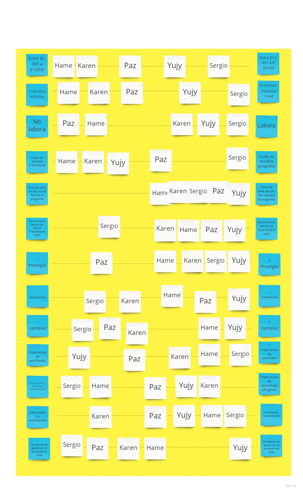

Matriz de acuerdo a arquetipos
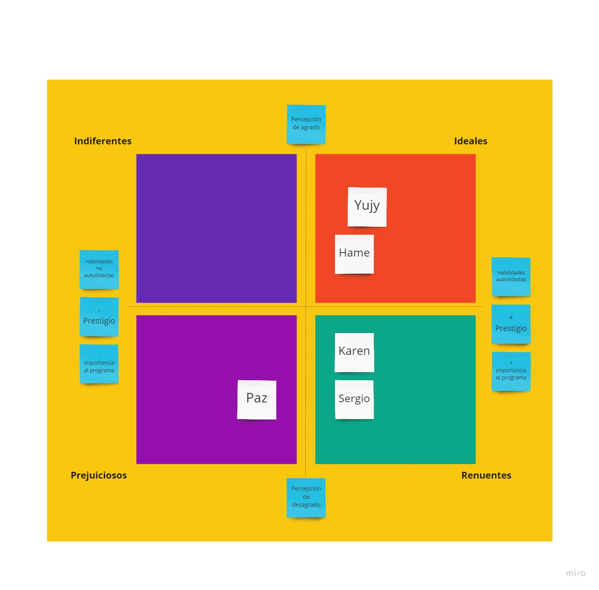

User persona principal: Sergio Ríos
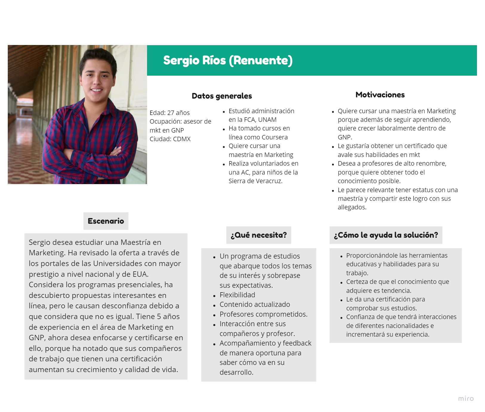

User persona secundario:Viviana Amicone
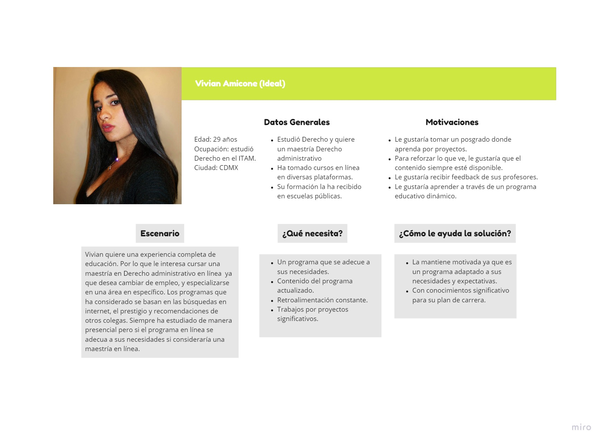

## Insight

Al analizar la información recabada, se enunciaron los siguientes puntos:

* La educación en línea no inspira confianza entre las personas interesadas en estudiar porque hay temor de no comprender los temas y no tener a alguien cercano para aclarar dudas.

“La educación en línea no provee la cercanía que necesito para aprender”

* Estudiar un posgrado incrementa el nivel de prestigio y mejora la posibilidad de tener un aumento en el sueldo, cambiar de puesto u obtener un nuevo trabajo. Sin embargo, las personas interesadas en estudiar consideran que los empleadores no valoran de la misma forma una carrera virtual a una convencional-presencial.

“La educación en línea nunca será igual a la educación presencial, en cuanto a calidad y prestigio. Puede ser un riesgo la inversión”

## Problema
De inicio, se realizó un Tree Problems que  ayudó a formular ciertas incógnitas sobre los problemas más relevantes en el ámbito educativo en línea, visto desde los diferentes stakeholders, conociendo las principales causas y también las consecuencias que intervienen en dichos problemas.

Después, con el ejercicio de 5 WHY’S, se pudo tener un acercamiendo a la causa raíz del problema. Algunas de las problemáticas más comunes salieron a través de las preguntas como:
- ¿Por qué las personas creen que la educación en línea no es tan buena como la educación presencial?
- ¿Por qué algunos cursos en línea no cuentan con las herramientas adecuadas para fomentar la modalidad en línea?

La problemática se eligió tomando en cuenta la opinión de todas las personas involucradas en el equipo. Como resultado, se realizó un clustering para determinar cuál era la solución que además de tener más valor fuera viable. En este sentido y para reafirmar la idea, se desarrolló el Iceberg Model que permitió ver el problema de fondo por medio de las preguntas:
- ¿Qué es lo que está pasando?
- ¿Desde cuándo sucede esto?
- ¿Qué está causando el patrón que estamos observando?

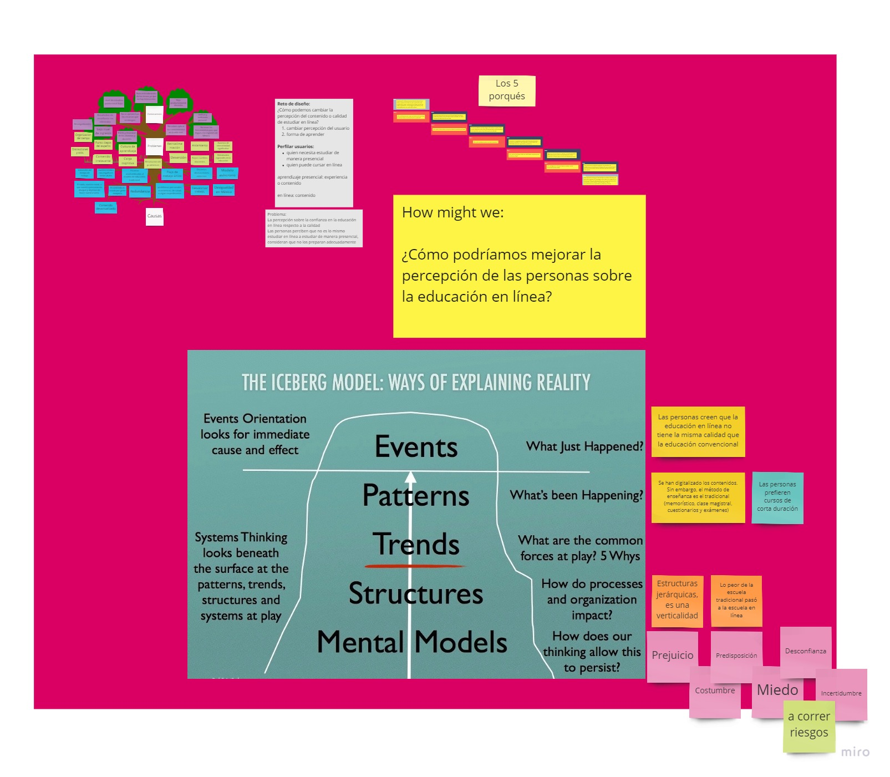

Con base en lo anterior, se generó el siguiente How Might We: ¿Cómo podríamos mejorar la percepción de la educación en línea?”, cuestión que serviría como parteaguas para la fase de ideación y propuesta de soluciones.Cabe mencionar que se eligió la problemática de la percepción debido a que es un problema real, el cual permitió involucrar al equipo en la verdadera propuesta para una solución a corto, mediano y largo plazo.

## Road Map ##
Por medio de la herramienta Trello se mapeó el proceso y estrategias a corto, mediano y largo plazo: esto guío al equipo a las acciones concretas para realizar la meta a corto plazo, ya que en la primera iteración, el research y llegar a la fase de ideación y problemática llevó mucho tiempo.

Roadmap en Trello
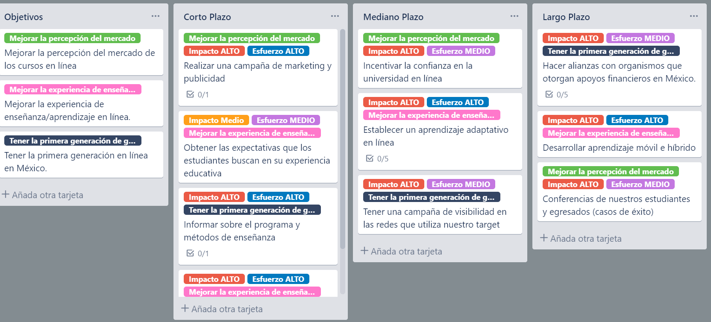

## Propuesta
Debido a que la problemática está centrada en el tema de la percepción, el equipo decidió no involucrarse con la plataforma o el contenido de los programas educativos sino en la forma en que se emite y percibe el mensaje sobre cómo podría alentarse a las personas a considerar estudiar en línea, a darle una oportunidad a una modalidad que no es la tradicional.

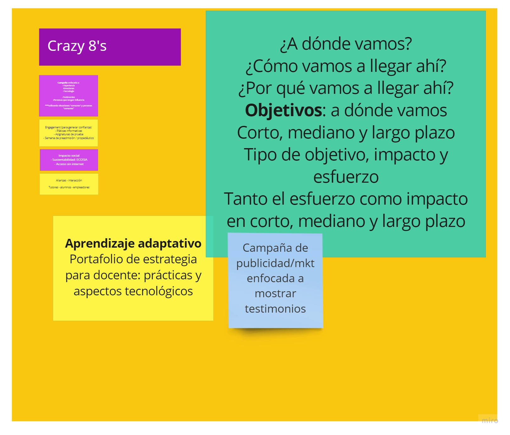

Crazy 8s

Clustering

Por tal motivo, se decidió crear una campaña de inbound marketing en redes sociales. Por cuestiones de tiempo, sólo se consideró Facebook. La metodología inbound consta de tres etapas: atraer, interactuar y deleitar con el propósito de generar confianza, credibilidad y motivación.

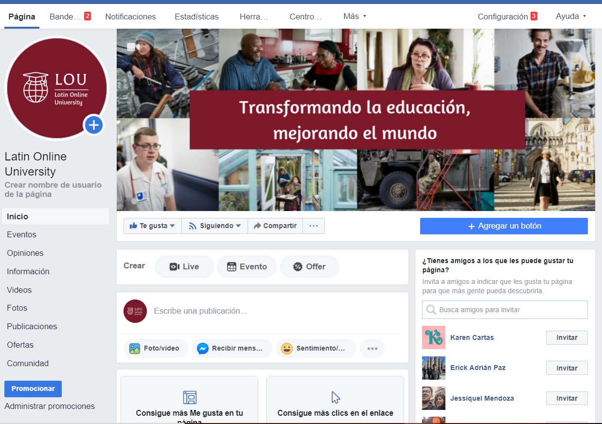

El inbound marketing consiste en crear experiencias valiosas que generen un impacto positivo tanto en las personas como en la empresa, es este caso la universidad con modalidad en línea. ¿Cómo? Se atraen prospectos y clientes a un sitio web a través de contenido útil y relevante. Una vez que se encuentran en el sitio, se interactúa con ellos mediante herramientas conversacionales, como el correo electrónico y el chat, y se les prometes valor a largo plazo. Por último, se deleita a los usuarios posicionándote como asesor y experto que comprende sus necesidades y se preocupa por su éxito.

En el segundo sprint se buscó crear contenido diseñado para abordar los problemas y las necesidades de los clientes ideales: se creó una fanpage de Facebook y como resultado se atrajo prospectos calificados. El contenido -imágenes e información- se compartió para generar confianza y credibilidad para la universidad en línea.

Logo

Publicación sobre aprendizaje adaptativo
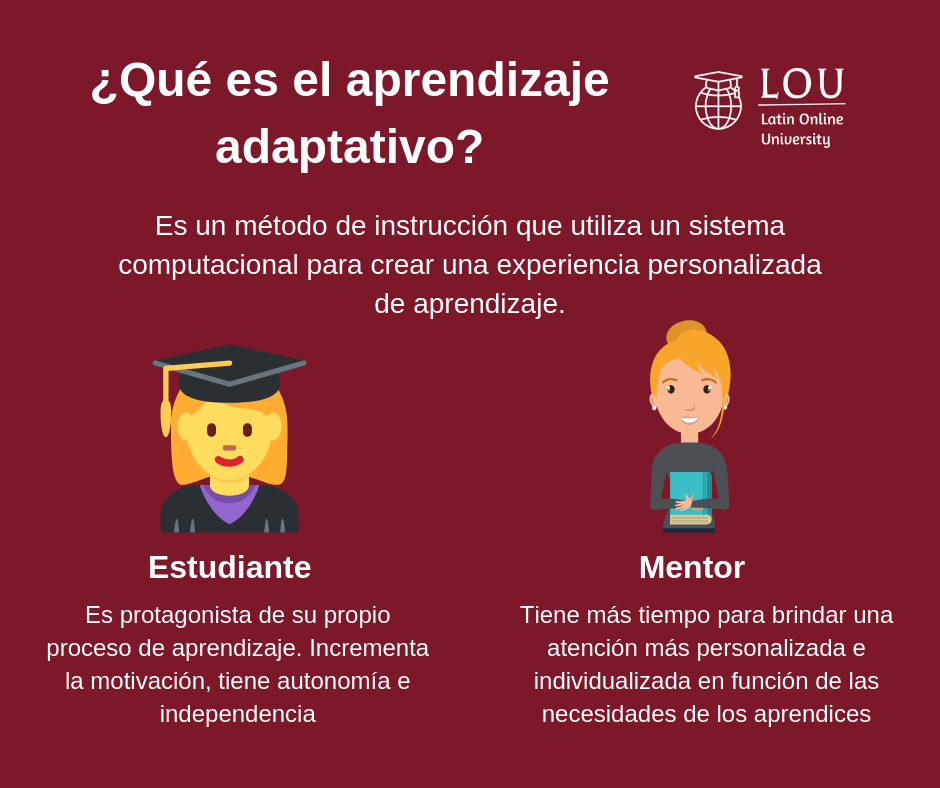

Testimonio de mentora
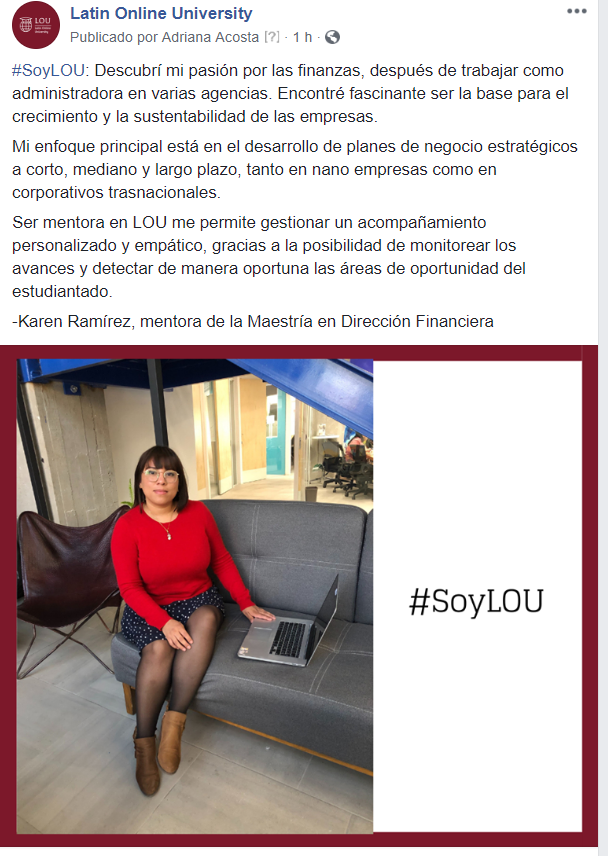

Explicación de cómo se aprende 
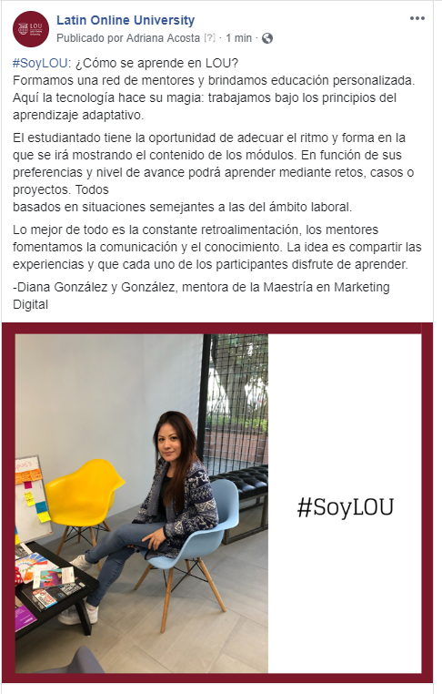

## Vídeos
Video como parte de la fase de lanzamiento con el propósito de informar y dar a conocer la universidad.

https://www.youtube.com/watch?v=AFg4g1Cva4c

Vídeo que muestra el alcance del segundo sprint (3 días), donde están las publicaciones, interacciones y alcances en Facebook.
https://www.loom.com/share/1536c7ed2edf4c89acbb68b72702964a

## Test / Hallazgos
Se realizó una encuesta a través de usabilityhub donde se mostraban las imágenes compartidas en Facebook para conocer la opinión de la gente. 

Entre los principales hallazgos:
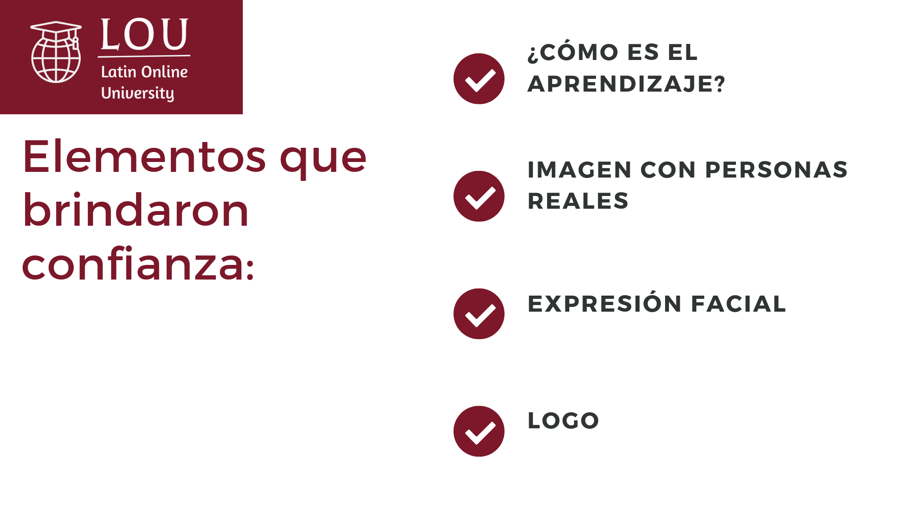

Las personas comentaron que ver a personas "reales" les brindaba confianza, no sólo por las expresiones faciales sino porque las percibían como personas normales. Otro elemento que brindó confianza fue el logo y el texto informativo en cada publicación.

